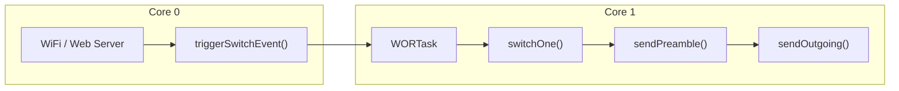

---

# 📄 **ESP32 Dual‑Core WOR Architecture — Technical Reference**  
### *William Lucid — E220 WOR Transmitter Architecture*

---

## **Table of Contents**
- **[Introduction](guide://action?prefill=Tell%20me%20more%20about%3A%20Introduction)**
- **[ESP32 Dual‑Core Model](guide://action?prefill=Tell%20me%20more%20about%3A%20ESP32%20Dual%E2%80%91Core%20Model)**
- **[Core Assignment Strategy](guide://action?prefill=Tell%20me%20more%20about%3A%20Core%20Assignment%20Strategy)**
- **[Task Creation & Scheduling](guide://action?prefill=Tell%20me%20more%20about%3A%20Task%20Creation%20%26%20Scheduling)**
- **[Task Notifications](guide://action?prefill=Tell%20me%20more%20about%3A%20Task%20Notifications)**
- **[Interrupt Handling](guide://action?prefill=Tell%20me%20more%20about%3A%20Interrupt%20Handling)**
- **[Critical Sections](guide://action?prefill=Tell%20me%20more%20about%3A%20Critical%20Sections)**
- **[Deep Sleep Integration](guide://action?prefill=Tell%20me%20more%20about%3A%20Deep%20Sleep%20Integration)**
- **[WOR Radio Pipeline](guide://action?prefill=Tell%20me%20more%20about%3A%20WOR%20Radio%20Pipeline)**
- **[Flowcharts](guide://action?prefill=Tell%20me%20more%20about%3A%20Flowcharts)**
- **[Glossary](guide://action?prefill=Tell%20me%20more%20about%3A%20Glossary)**
- **[Appendix: Code Snippets](guide://action?prefill=Tell%20me%20more%20about%3A%20Appendix%3A%20Code%20Snippets)**

---

# 1. **Introduction**

This document describes the **dual‑core architecture** used in the ESP32 E220 WOR Remote Switch Transmitter. It explains how Core 0 and Core 1 cooperate to deliver deterministic radio timing, non‑blocking WiFi, and instant AUX‑driven wakeups.

---

# 2. **ESP32 Dual‑Core Model**

The ESP32 contains two independent CPU cores:

- **Core 0** → WiFi, TCP/IP, system tasks  
- **Core 1** → Application logic (WOR radio task)

FreeRTOS runs across both cores and provides the primitives used in this architecture.

---

# 3. **Core Assignment Strategy**

| Core | Responsibilities |
|------|------------------|
| **Core 0** | WiFi, web server, HTTP handlers, triggerSwitchEvent() |
| **Core 1** | WORTask, switchOne(), sendPreamble(), sendOutgoing() |

This separation prevents WiFi starvation and ensures deterministic radio behavior.

---

# 4. **Task Creation & Scheduling**

### **xTaskCreatePinnedToCore()**

Creates a FreeRTOS task pinned to a specific core.

```cpp
xTaskCreatePinnedToCore(
    WORTask,
    "WORTask",
    4096,
    NULL,
    1,
    &worTaskHandle,
    1
);
```

**Purpose:**  
Guarantees WOR logic always runs on Core 1.

---

# 5. **Task Notifications**

### **xTaskNotifyGive()**

Wakes a task from another task.

```cpp
xTaskNotifyGive(worTaskHandle);
```

### **vTaskNotifyGiveFromISR()**

ISR‑safe version.

```cpp
vTaskNotifyGiveFromISR(worTaskHandle, &xHigherPriorityTaskWoken);
```

### **ulTaskNotifyTake()**

Waits for a notification.

```cpp
ulTaskNotifyTake(pdTRUE, portMAX_DELAY);
```

**Purpose:**  
Replaces all AUX polling loops.

---

# 6. **Interrupt Handling**

### **attachInterrupt()**

```cpp
attachInterrupt(digitalPinToInterrupt(AUX_PIN), auxISR, FALLING);
```

**Why FALLING?**  
E220 AUX goes LOW when:

- TX completes  
- Module becomes idle  
- WOR preamble is received  

---

# 7. **Critical Sections**

Used to safely share data between cores.

```cpp
portENTER_CRITICAL(&mux);
switchFlag = true;
switchData = 1;
portEXIT_CRITICAL(&mux);
```

---

# 8. **Deep Sleep Integration**

### **esp_sleep_enable_ext0_wakeup()**

Wake on AUX LOW.

### **gpio_hold_en()**

Retains pin state during deep sleep.

### **esp_deep_sleep_start()**

Enters deep sleep.

---

# 9. **WOR Radio Pipeline**

```
switchFlag set → WORTask wakes → switchOne() → sendPreamble() → sendOutgoing()
```

### **switchFlag**  
Consumed only once in switchOne().

### **sendPreamble()**  
Unconditional.

### **sendOutgoing()**  
Unconditional.

---

# 10. **Flowcharts**

## **A. System Flow (Mermaid)**



---

## **B. Architecture Diagram (Mermaid)**


---

## **C. ASCII Flowchart**

```
[Web Request]
      |
      v
[triggerSwitchEvent()]
      |
      v
[xTaskNotifyGive]
      |
      v
[Core 1: WORTask]
      |
      v
[switchOne()]
      |
      v
[sendPreamble()]
      |
      v
[sendOutgoing()]
```

---

# 11. **Glossary**

| Term | Meaning |
|------|---------|
| **WOR** | Wake‑On‑Radio |
| **AUX** | E220 status pin |
| **ISR** | Interrupt Service Routine |
| **Core 0** | WiFi + system core |
| **Core 1** | Application core |
| **Task Notification** | Lightweight inter‑task signal |
| **Critical Section** | Atomic access region |
| **Deep Sleep** | Ultra‑low power mode |

---

# 12. **Appendix: Key Code Snippets**

## **AUX ISR**

```cpp
void IRAM_ATTR auxISR() {
    BaseType_t xHigherPriorityTaskWoken = pdFALSE;
    vTaskNotifyGiveFromISR(worTaskHandle, &xHigherPriorityTaskWoken);
    portYIELD_FROM_ISR(xHigherPriorityTaskWoken);
}
```

## **WOR Task**

```cpp
void WORTask(void *pvParameters) {
    for (;;) {
        ulTaskNotifyTake(pdTRUE, portMAX_DELAY);

        bool localFlag;
        int localData;

        portENTER_CRITICAL(&mux);
        localFlag = switchFlag;
        localData = switchData;
        portEXIT_CRITICAL(&mux);

        if (localFlag)
            switchOne(localData);

        vTaskDelay(pdMS_TO_TICKS(1));
    }
}
```

## **Event Trigger**

```cpp
void triggerSwitchEvent(int value) {
    portENTER_CRITICAL(&mux);
    switchData = value;
    switchFlag = true;
    portEXIT_CRITICAL(&mux);

    xTaskNotifyGive(worTaskHandle);
}
```

---

# 👥 Contributors

### **Primary Developer**
**William Lucid**  
Lead architect, embedded systems developer, and creator of the E220 WOR Remote Switch Transmitter.  
Responsible for system design, implementation, testing, and integration of all hardware and firmware components.

### **AI Engineering Assistance**
**Microsoft Copilot**  
Provided architectural guidance, dual‑core FreeRTOS design patterns, interrupt‑driven WOR pipeline,  
code refactoring support, and technical documentation including flowcharts, diagrams, and PDF‑ready materials.

### **Acknowledgments**
Special thanks to the open‑source community and the maintainers of the **LoRa_E220** library,  
whose work made reliable EBYTE module integration possible.

---


